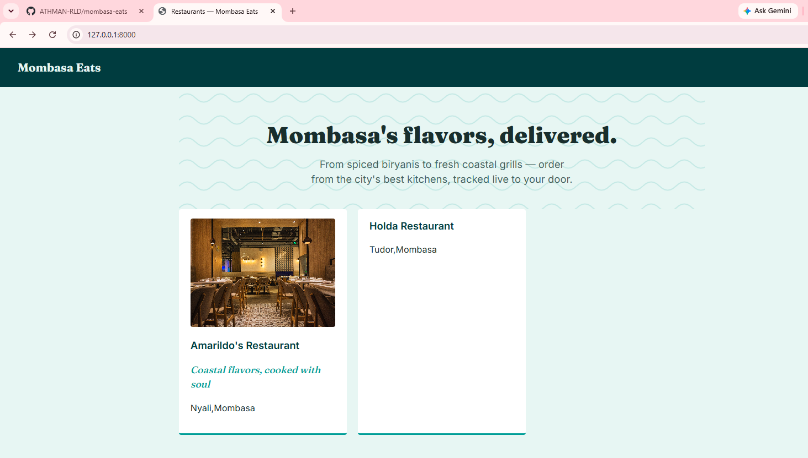
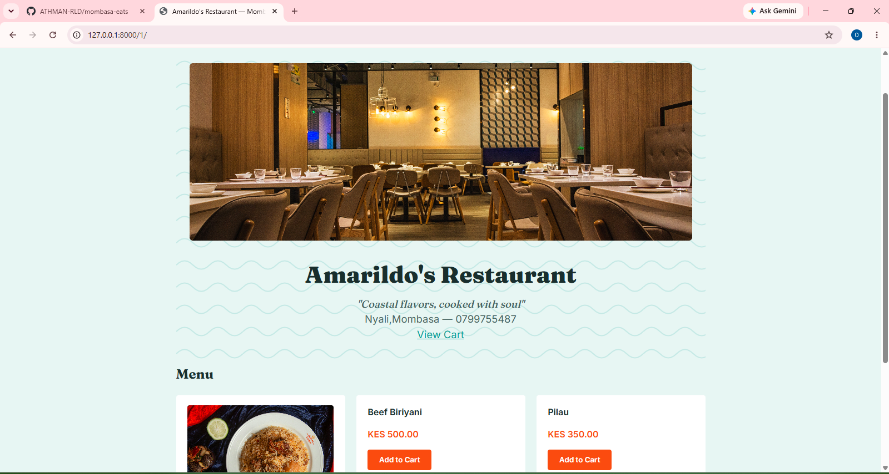
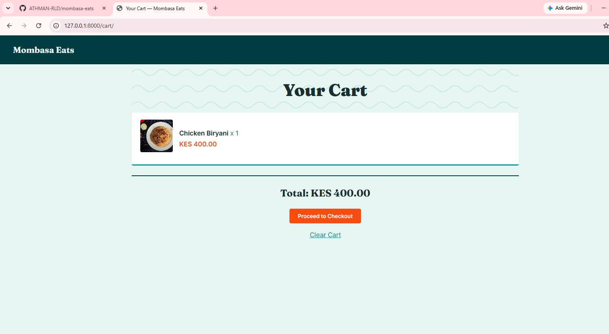
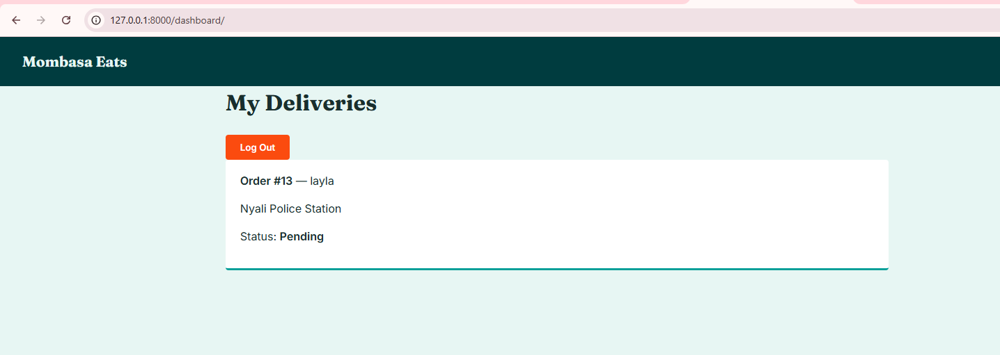

# Mombasa Eats

A full-stack food ordering and delivery platform for Mombasa, Kenya — built with Django, M-Pesa Daraja payments, and live GPS delivery tracking.

## Screenshots

| Restaurants | Menu |
|---|---|
|  |  |

| Cart | Rider Dashboard |
|---|---|
|  |  |

## Features

- **Multi-restaurant ordering** — browse restaurants and menus, add items to a session-based cart
- **M-Pesa integration** — real Safaricom Daraja STK Push payments, with asynchronous callback handling to confirm transactions
- **Rider delivery pipeline** — a dedicated rider dashboard to manage assigned orders through a full status pipeline (Paid → Preparing → Picked Up → En Route → Delivered)
- **Live GPS tracking** — customers see their rider's real-time position on an interactive map (Leaflet + OpenStreetMap), updated via the rider's live device location

## Tech Stack

- **Backend:** Django, SQLite (development)
- **Payments:** Safaricom M-Pesa Daraja API (STK Push)
- **Maps:** Leaflet.js, OpenStreetMap
- **Frontend:** Django templates, vanilla JavaScript, CSS

## Project Structure

- `restaurants/` — restaurant and menu models, browsing views
- `orders/` — cart, checkout, and order pipeline
- `payments/` — M-Pesa Daraja integration (OAuth, STK Push, callbacks)
- `accounts/` — rider accounts, login, and delivery dashboard
- `tracking/` — live GPS location updates and retrieval

## Setup

1. Clone the repository and create a virtual environment:
```bash
   git clone https://github.com/ATHMAN-RLD/mombasa-eats.git
   cd mombasa-eats
   python -m venv venv
   venv\Scripts\activate
```

2. Install dependencies:
```bash
   pip install -r requirements.txt
```

3. Create a `.env` file in the project root with your own M-Pesa Daraja sandbox credentials:  